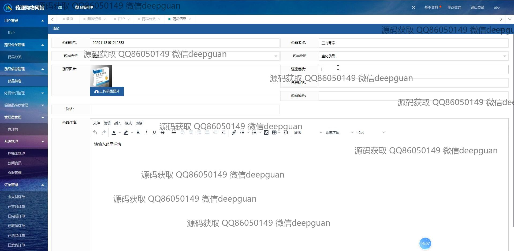

<h1 align="center">药源药品商城保健品购物网站vue</h1>

## 简介
药源药品商城保健品购物网站：角色分为管理员和用户；注册与个人中心，在线客服，商品详情与购物车，订单管理及支付，商品分类与推荐，后台管理等功能。    --计算机毕业设计源码；毕设源码；java毕业设计源码

## 联系方式

<h3 align="center">获取完整代码与数据库文件 + 微信：deepguan QQ: 86050149 QQ群: 783742310</h3>

<h3 align="center">可帮忙远程部署 包运行成功！提供远程部署、修改代码、设计文档指导、代码讲解等服务！</h3>

## 功能介绍（完整见运行截图）
管理员：基本功能包括登录、注册、退出管理账号；后台支持药品分类管理、用户管理、订单管理和系统设置；商品管理涵盖信息添加、分类、修改和删除功能；订单模块可查看订单详情及管理未支付、已支付、已完成和退款订单；资讯模块支持发布药品和健康信息；提供药品推荐管理、用户互动管理及后台系统优化。

用户：基本功能包括登录、注册、退出用户账号；网站首页提供导航栏、轮播图展示、热门商品推荐；商品模块支持药品搜索、浏览详情、加入购物车、结算和在线付款；个人中心功能包括查看及修改个人信息、查询订单记录、管理地址和收藏商品；实时在线客服为用户提供咨询服务。

## 运行截图

本代码来源于网络,仅供学习参考使用!

